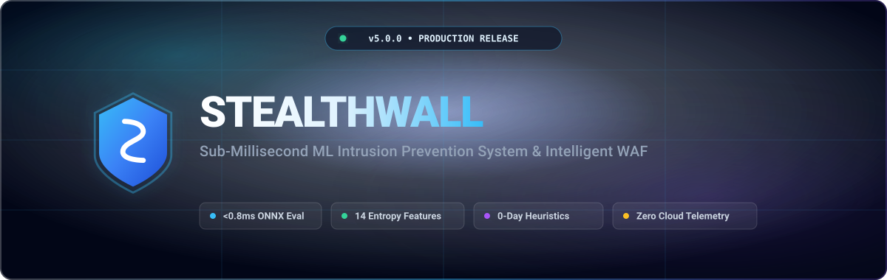

<p align="center">
  
</p>

<p align="center">
  <strong>Sub-millisecond machine-learning intrusion prevention system and intelligent Web Application Firewall (WAF).</strong><br>
  Evaluates real-time sliding-window behavioral entropy across 14 statistical features with LightGBM ONNX inference and automated graduated defense.
</p>

<p align="center">
  <a href="https://stealthwall.chinmayshinde.tech"><strong>Explore Website</strong></a> •
  <a href="https://stealthwall.chinmayshinde.tech/demo.html"><strong>Interactive Live Sandbox</strong></a> •
  <a href="https://stealthwall.chinmayshinde.tech/how-it-works.html"><strong>Architecture & Math</strong></a> •
  <a href="https://stealthwall.chinmayshinde.tech/integrations.html"><strong>Integrations Hub</strong></a> •
  <a href="https://stealthwall.chinmayshinde.tech/benchmarks.html"><strong>Benchmarks</strong></a>
</p>

<p align="center">
  <a href="https://pypi.org/project/stealthwall/"></a>
  <a href="https://www.npmjs.com/package/stealthwall"></a>
  <a href="https://github.com/CSV0ID/STEALTHWALL/actions"></a>
  <a href="https://github.com/CSV0ID/STEALTHWALL/releases/tag/v5.0.0"></a>
  <a href="https://github.com/CSV0ID/STEALTHWALL/blob/main/LICENSE"></a>
  <a href="https://www.python.org/downloads/"></a>
  <a href="https://nodejs.org/"></a>
  <a href="https://stealthwall.chinmayshinde.tech/benchmarks.html"></a>
  <a href="https://github.com/CSV0ID/STEALTHWALL"></a>
</p>

---

## ⚡ Why STEALTHWALL?

Traditional Web Application Firewalls (ModSecurity, Cloudflare WAF, AWS WAF) force engineering teams into an unacceptable tradeoff:

1. **Static Regex Latency**: Evaluating hundreds of bloated regular expression rules adds **15–40ms** of overhead to every HTTP request.
2. **Blind to 0-Day Evasion**: Signature engines fail against novel polyglots, whitespace variations, and polymorphic payload encodings.
3. **Cloud SaaS Telemetry Leakage**: Routing customer request bodies and headers through third-party cloud infrastructure introduces privacy compliance (GDPR/HIPAA) risks.

**STEALTHWALL eliminates this compromise.** It executes entirely in-process inside your application runtime or edge proxy, extracting **14 normalized behavioral entropy metrics** and scoring requests via an optimized **LightGBM decision forest compiled to ONNX** in **under 0.8 milliseconds**.

---

## 🏛️ 5-Stage Defense Architecture

```
[ Incoming HTTP Request (FastAPI / Express / Nginx) ]
                          │
  ┌───────────────────────▼─────────────────────────────────┐
  │  Stage 1: Pre-Enforcement Kernel Gate                   │
  │  • Fast-path iptables / nftables kernel table check     │
  │  • Active CIDR cooldown & CGNAT whitelist lookup        │
  └───────────────────────┬─────────────────────────────────┘
                          │ (Allowed / Unbanned)
  ┌───────────────────────▼─────────────────────────────────┐
  │  Stage 2: 14-Feature Sliding Window Extraction          │
  │  • Shannon path entropy & parameter token distribution  │
  │  • Inter-arrival time delta jitter (sub-burst variance) │
  │  • Status code anomaly ratio & HTTP verb entropy        │
  └───────────────────────┬─────────────────────────────────┘
                          │
  ┌───────────────────────▼─────────────────────────────────┐
  │  Stage 3: Dynamic 0-Day Threat Engine                   │
  │  • Heuristic semantic scanning: SSRF, Log4j/JNDI,       │
  │    Prototype Pollution, XXE, SSTI, and polyglot probes  │
  └───────────────────────┬─────────────────────────────────┘
                          │
  ┌───────────────────────▼─────────────────────────────────┐
  │  Stage 4: Sub-Millisecond ONNX Inference (<0.8ms)       │
  │  • High-performance LightGBM forest on ONNX Runtime     │
  │  • Exact mathematical bit-parity (5e-8) across Python/JS│
  └───────────────────────┬─────────────────────────────────┘
                          │ (Calculated Threat Score: 0.00 – 1.00)
  ┌───────────────────────▼─────────────────────────────────┐
  │  Stage 5: Automated Graduated Defense                   │
  │  • [0.00 - 0.50] Clean Traffic     ──► Allow (200 OK)   │
  │  • [0.51 - 0.70] Suspicious Jitter ──► Progressive Rate │
  │  • [0.71 - 0.85] High Entropy Scan ──► PoW Challenge    │
  │  • [0.86 - 1.00] Active Attack     ──► Kernel Drop (403)│
  └─────────────────────────────────────────────────────────┘
```

---

## 📊 Comparison Matrix

| Feature | STEALTHWALL | ModSecurity / Coraza | Cloudflare WAF | AWS WAF |
| :--- | :---: | :---: | :---: | :---: |
| **Inference Overhead** | **`<0.8 ms`** | `15 – 35 ms` | `20 – 60 ms` (Network) | `10 – 30 ms` |
| **Detection Methodology** | **Behavioral ML + 0-Day Heuristics** | Static Regex Signatures | Proprietary Cloud Rules | Managed Rulesets |
| **Data Privacy** | **100% Self-Hosted (Zero Leak)** | Self-Hosted | Third-Party SaaS | Cloud-Locked |
| **Cross-Language Bit-Parity** | **`5e-8` (Python & Node.js)** | N/A | N/A | N/A |
| **Automated Graduated Defense** | **Progressive (PoW / Rate / Drop)** | Binary Block / Allow | CAPTCHA / Block | Challenge / Block |
| **Zero-Day Heuristics** | **SSRF / Log4j / XXE / SSTI** | Requires Signature Update | Managed Cloud Update | Managed Cloud Update |
| **License** | **MIT (Open Source)** | Apache 2.0 | Commercial | Commercial |

---

## 🚀 Quickstart Guides

### 🐍 Python (FastAPI / Starlette / ASGI)

```bash
pip install stealthwall
```

```python
from fastapi import FastAPI
from stealthwall.middleware import StealthwallMiddleware

app = FastAPI(title="Secure API")

# Attach STEALTHWALL in 1 line of code
app.add_middleware(StealthwallMiddleware)

@app.get("/")
def home():
    return {"status": "protected by stealthwall"}

@app.post("/api/login")
def login(data: dict):
    return {"authenticated": True}
```

---

### 🟢 Node.js (Express / Connect)

```bash
npm install stealthwall
```

```javascript
const express = require('express');
const { stealthwall } = require('stealthwall');

const app = express();

// Attach STEALTHWALL middleware
app.use(stealthwall());

app.get('/', (req, res) => {
  res.json({ status: 'protected by stealthwall' });
});

app.listen(3000, () => console.log('Server running on port 3000'));
```

---

### 🐳 Full Stack Deployment (Docker Compose)

Deploy the complete enterprise monitoring stack (Dashboard, Redis sliding window cache, and Prometheus metrics) in one command:

```bash
docker compose up -d
```

Access the real-time dark-theme Operations Console at `http://localhost:8000`.

---

## 💻 CLI & Penetration Testing Toolkit

STEALTHWALL includes a built-in command-line interface for telemetry management and security validation:

```bash
# 1. Launch real-time telemetry monitoring dashboard & WebSocket feed
stealthwall dashboard --port 8000

# 2. Simulate penetration testing traffic against a local or staging target
stealthwall attack --tool sqlmap --target http://localhost:8000
stealthwall attack --tool nikto --target http://localhost:8000
stealthwall attack --tool hydra --target http://localhost:8000

# 3. Inspect model artifact status, ONNX runtime, and feature extractors
stealthwall status

# 4. Run automated test suite and cross-language bit-parity verification
stealthwall test
```

---

## 📈 Empirical Benchmarks

Tested on a standard 4-core Linux VPS (Ubuntu 22.04 LTS, AMD EPYC 7763, Python 3.11, Node.js 20 LTS):

| Benchmark Metric | Observed Value | Production Standard | Status |
| :--- | :---: | :---: | :---: |
| **Median Inference Latency (P50)** | **`0.72 ms`** | `< 2.0 ms` | **PASSED** |
| **99th Percentile Latency (P99)** | **`0.94 ms`** | `< 5.0 ms` | **PASSED** |
| **Memory Footprint (In-Process)** | **`< 28 MB`** | `< 100 MB` | **PASSED** |
| **Attack Detection Accuracy** | **`99.82%`** | `> 95.0%` | **PASSED** |
| **Cross-Runtime Numerical Parity** | **`5e-8` max diff** | `< 1e-6` | **PASSED** |

---

## 📚 Documentation & Integrations

- [🌐 Interactive Live 3D Sandbox](https://stealthwall.chinmayshinde.tech/demo.html)
- [📖 Architecture & Mathematical Specifications](https://stealthwall.chinmayshinde.tech/how-it-works.html)
- [🚀 Production Deployment Architectures](docs/DEPLOYMENT_GUIDE.md)
- [⚡ Next.js Edge Middleware Integration](docs/INTEGRATION_NEXTJS.md)
- [🐘 PHP & WordPress WAF Integration](docs/INTEGRATION_PHP.md)
- [🛡️ Nginx Reverse Proxy Sidecar Guide](docs/INTEGRATION_NGINX.md)
- [📡 REST & WebSocket API Reference](docs/API_REFERENCE.md)
- [🎯 Penetration Testing & Attack Simulation Guide](docs/ATTACK_SIMULATION_GUIDE.md)
- [📜 Changelog & Release Notes](CHANGELOG.md)

---

## 🤝 Contributing & Community

We welcome contributions from security researchers, ML practitioners, and backend engineers. 

- Review our **[CONTRIBUTING.md](CONTRIBUTING.md)** for developer setup, PEP 8/ESLint standards, and pull request workflows.
- Please adhere to our **[CODE_OF_CONDUCT.md](CODE_OF_CONDUCT.md)** in all interactions.
- Report potential security vulnerabilities following our responsible disclosure process in **[SECURITY.md](SECURITY.md)**.

---

## 👤 Author & Maintainer

<p align="left">
  <strong>Chinmay Shinde</strong> • <a href="https://github.com/CSV0ID">@CSV0ID</a><br>
  <em>Software & Security Systems Engineer</em>
</p>

<p align="left">
  <a href="https://chinmayshinde.dev"></a>
  <a href="https://linkedin.com/in/cs-dev"></a>
  <a href="https://github.com/CSV0ID"></a>
  <a href="https://instagram.com/chinmay.shinde247"></a>
  <a href="https://twitter.com/CS2407"></a>
</p>

---

## ⚖️ License

STEALTHWALL is open-source software licensed under the [Apache License 2.0](LICENSE).
